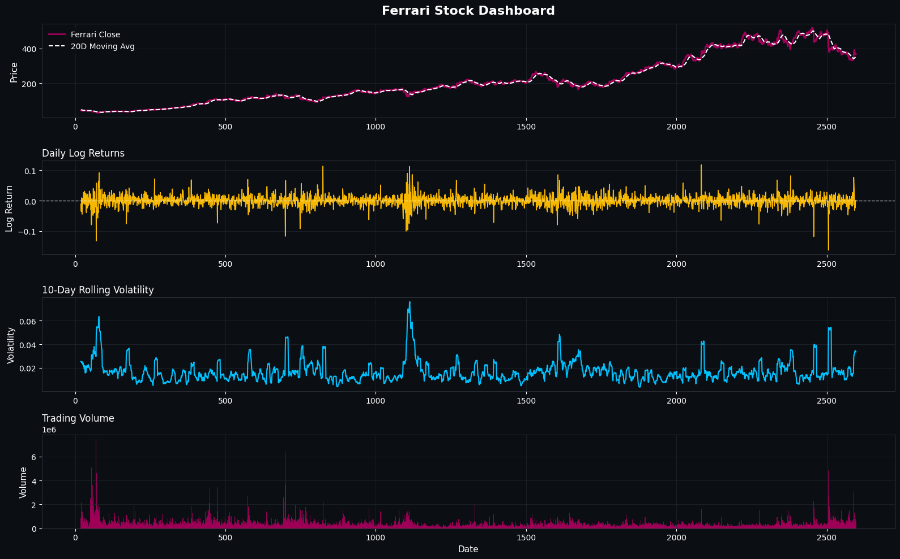
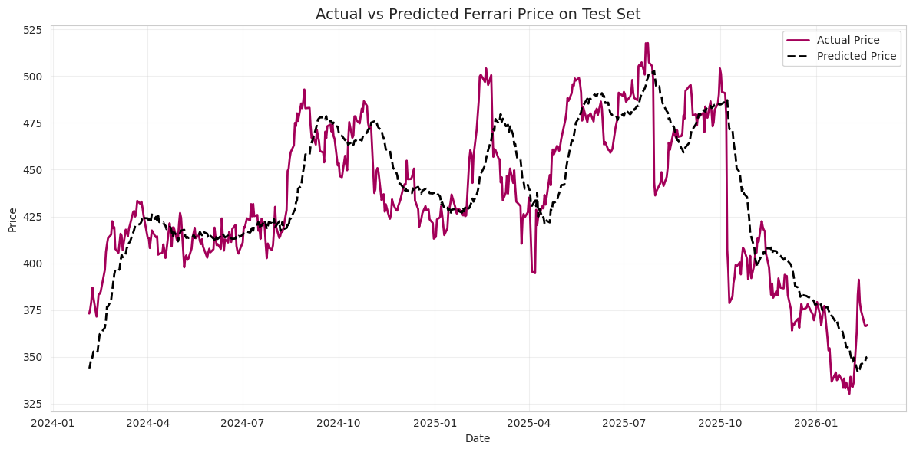

# Ferrari Stock Price Analysis & Prediction

## Project Description
This project focuses on analyzing and predicting Ferrari’s stock price using financial data and data science techniques. By combining Ferrari-specific indicators, such as volatility and momentum, with broader market variables like the S&P 500 returns and VIX changes, the analysis aims to understand the key drivers behind stock price movements. The project follows a structured data science workflow, including data cleaning, feature engineering, exploratory data analysis, and the application of a linear regression model to generate predictions and insights.

---

## Problem Statement
Predicting stock prices is a complex task due to the high level of uncertainty, volatility, and external influences present in financial markets. Ferrari’s stock, in particular, is affected not only by its internal performance but also by broader market conditions and investor sentiment. The main problem addressed in this project is determining whether a combination of technical indicators and market variables can effectively explain and predict the future behavior of Ferrari’s stock price.

---

## Importance
Understanding the factors that drive stock price movements is essential for investors, analysts, and decision-makers. This project is important because it provides a data-driven approach to analyzing Ferrari’s stock, helping to identify how internal dynamics and external market conditions interact. By applying statistical and machine learning techniques, the analysis contributes to more informed investment decisions, better risk management, and a deeper understanding of market behavior in the context of a luxury automotive company.

---

## Key Insights
The results show that both firm-specific and market-related variables play a significant role in explaining Ferrari’s stock price. In particular, the strong relationship with the S&P 500 highlights the influence of overall market performance, while volatility and momentum provide valuable information about risk and trend dynamics. The model demonstrates a solid ability to capture general price movements, although it struggles with sudden fluctuations. Overall, the findings suggest that combining multiple types of indicators can improve the understanding of stock behavior and support more informed, data-driven decision-making.

This is a dashboard showing the trend of the stock and other indicators 

---

This is the prediction that our model made 

